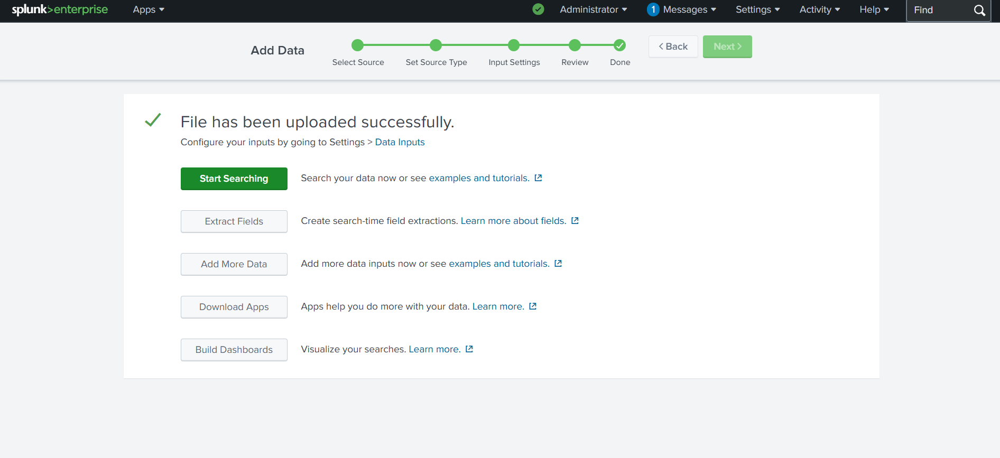
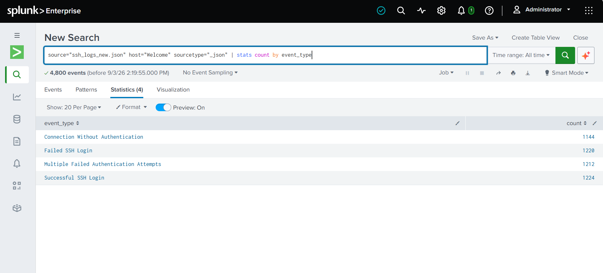
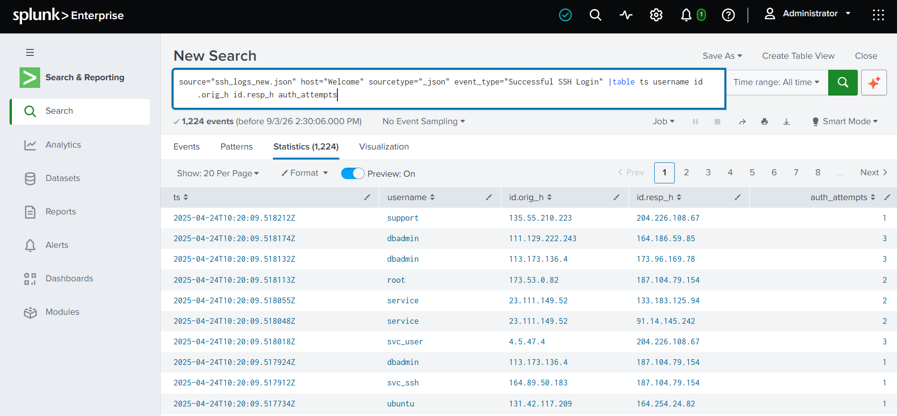
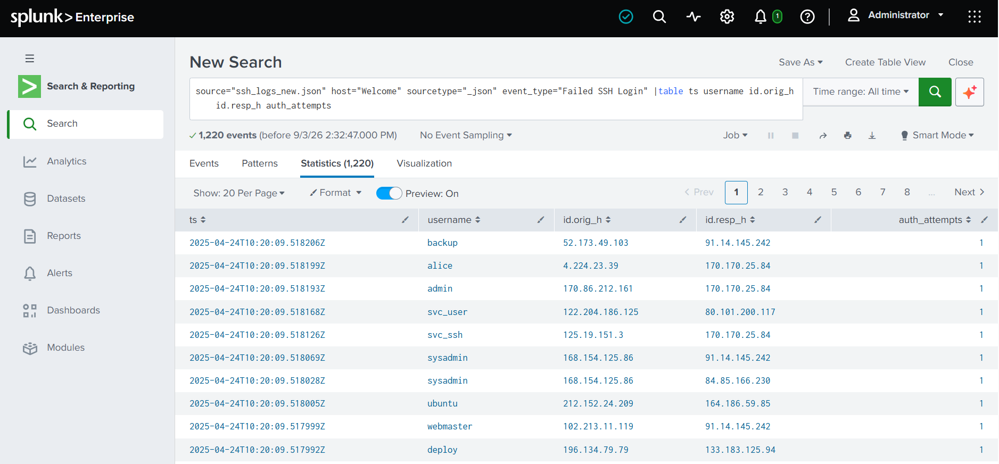
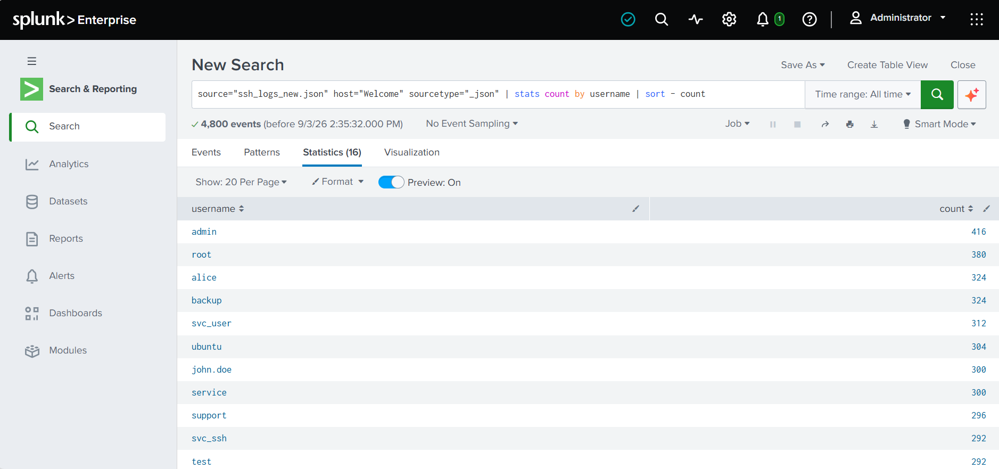
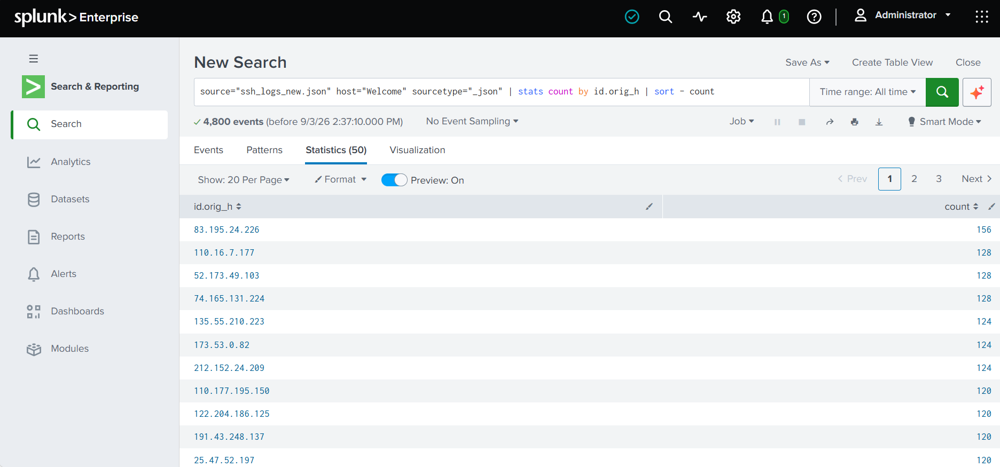
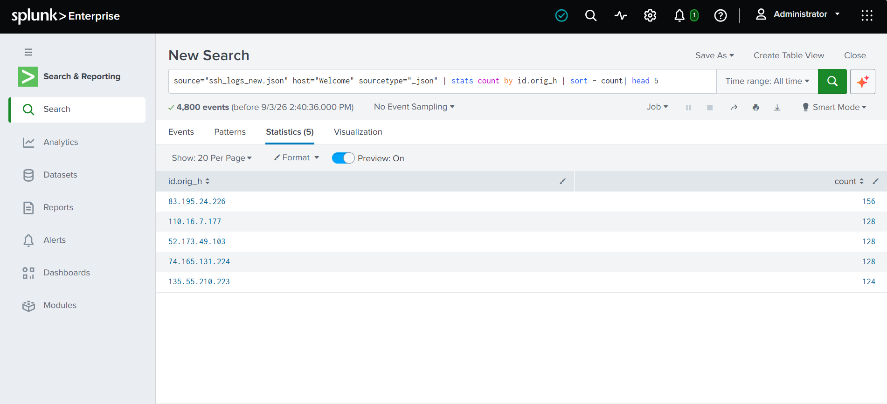
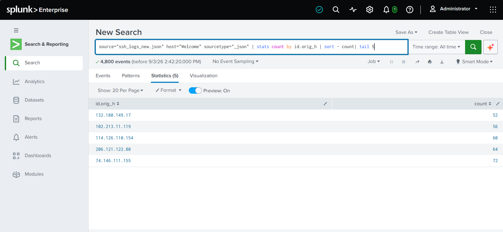
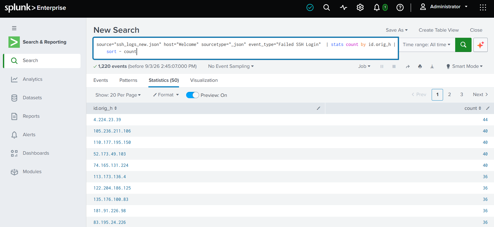

# Splunk-SSH-Log-Analysis
SSH log analysis and suspicious authentication detection using Splunk SPL, including failed/successful logins, brute-force detection, suspicious IP analysis.

How To upload Log File In Splunk

1. Open Splunk

Open your Splunk Web: http://localhost:8000

Login to Splunk.

2. Go to Add Data

From the Splunk home page:

Settings → Add Data → Upload

3. Select your SSH log file

Click Select File and choose your log file

# SPL-Commands
**1. Total SSH Event Count**

Description: Provides the total number of events for each SSH activity type, such as successful login, failed login, and connection without authentication.

source="ssh_logs_new.json" host="Welcome" sourcetype="_json"
| stats count by event_type

**2. Successful Login Attempts**

Description: Displays successful SSH login attempts with timestamp, username, source IP, destination IP, and authentication attempts.

source="ssh_logs_new.json" host="Welcome" sourcetype="_json" event_type="Successful SSH Login"
| table ts username id.orig_h id.resp_h auth_attempts

**3. Failed Login Attempts**

Description: Displays failed SSH login attempts with timestamp, username, source IP, destination IP, and authentication attempts.

source="ssh_logs_new.json" host="Welcome" sourcetype="_json" event_type="Failed SSH Login"
| table ts username id.orig_h id.resp_h auth_attempts

**4. Most Targeted Usernames**

Description: Identifies usernames that were targeted most frequently in SSH login activity.

source="ssh_logs_new.json" host="Welcome" sourcetype="_json"
| stats count by username
| sort - count

**5. Most Active IP Addresses**

Description: Identifies source IP addresses generating the highest number of SSH events.

source="ssh_logs_new.json" host="Welcome" sourcetype="_json"
| stats count by id.orig_h
| sort - count

**6. Top 5 Most Active IP Addresses**

Description: Shows the top 5 source IP addresses with the highest number of SSH events.

source="ssh_logs_new.json" host="Welcome" sourcetype="_json"
| stats count by id.orig_h
| sort - count
| head 5

**7. Bottom 5 Less Active IP Addresses**

Description: Shows the 5 IP addresses with the lowest number of SSH events.

source="ssh_logs_new.json" host="Welcome" sourcetype="_json"
| stats count by id.orig_h
| sort - count
| tail 5

**8. Failed Login Attempts by IP Address**

Description: Counts failed SSH login attempts for each source IP address and sorts them from highest to lowest.

source="ssh_logs_new.json" host="Welcome" sourcetype="_json" event_type="Failed SSH Login"
| stats count by id.orig_h
| sort - count

